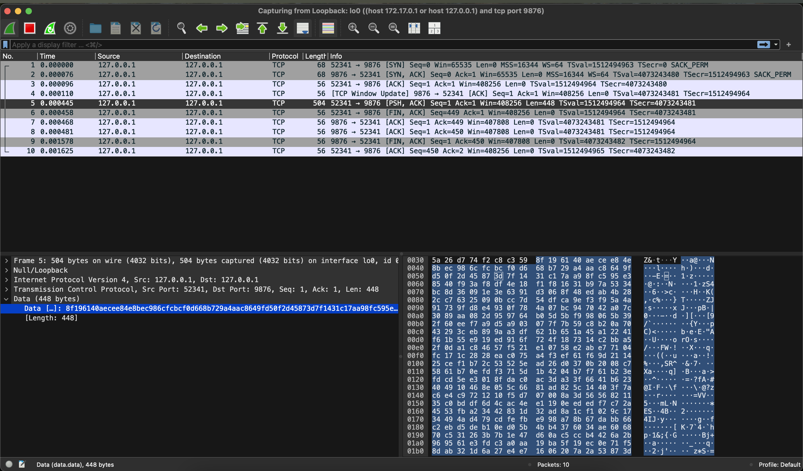
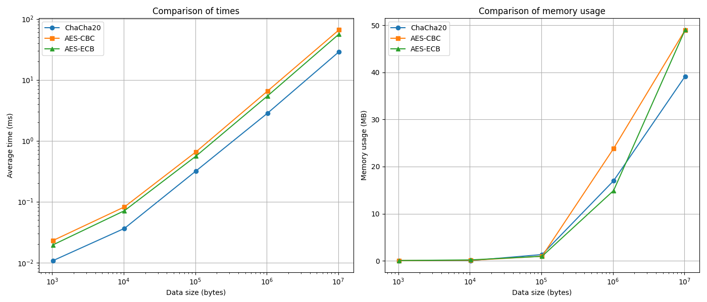

# Lab3

## Part 1
[IR](https://github.com/Montoya086/information-ciphers/tree/main/Lab3/Part-1)

### Ejecución
```bash
cd Part-1
python main.py
```

### Preguntas
**¿Por qué el cifrado ECB revela los patrones de la imagen?**

Porque ECB cifra cada bloque independientemente, sin usar un vector de inicialización. Esto significa que bloques idénticos de la imagen se cifrarán de manera idéntica, manteniendo los patrones visuales originales.

**¿Cómo cambia la apariencia con CBC?**

Utilizando CBC se puede observar una mayor aleatoriedad que no permite ver los patrones de la imagen.

**¿Qué tan seguro es usar ECB para cifrar datos estructurados?**

No es seguro. ECB no oculta patrones ni relaciones entre bloques, lo que puede revelar información sensible en datos estructurados.

## Part 2
[IR](https://github.com/Montoya086/information-ciphers/tree/main/Lab3/Part-2)

### Ejecución
```bash
cd Part-2
docker-compose up (--build)
```

```bash
cd Part-2
python client.py
```

### Preguntas
**¿Se puede identificar que los mensajes están cifrados con AES-CBC?**

Como se puede observar en la imagen, el texto enviado está totalmente cifrado. A simple vista no es posible identificar el algoritmo utilizado, pero en una comunicación real se suele enviar el algoritmo utilizado en los headers de la solicitud.

**¿Cómo podríamos proteger más esta comunicación?**

Se puede mejorar de muchas maneras, pero la principal mejora que se puede hacer es incluir un algoritmo de autenticidad para evitar la modificación del mensaje por terceros.

## Part 3
[IR](https://github.com/Montoya086/information-ciphers/tree/main/Lab3/Part-3)

### Ejecución
```bash
cd Part-3
python main.py
```

### Preguntas
**¿Analizar que cifrado es mas rápido ChaCha20 o AES?**

Como se puede observar en los resultados, ChaCha20 es mucho más rapido que AES. Se puede observar que todos los algoritmos poseen un uso de memoria similar con pocos datos, pero AES se dispara mientras los datos aumentan.

**¿En qué casos debería usarse ChaCha20 en vez de AES?**

ChaCha20 es preferible en:
- Dispositivos con recursos limitados
- Aplicaciones móviles
- Comunicaciones rápidas que requieren bajo consumo
- Entornos con procesadores que no soporten AES-NI*

*AES-NI (Advanced Encryption Standard New Instructions): Es un conjunto de instrucciones de CPU introducidas por procesadores Intel para acelerar las operaciones de cifrado AES en hardware. (Intel® Advanced Encryption Standard Instructions (AES-NI), 2025)

## Parte 4
[IR](https://github.com/Montoya086/information-ciphers/tree/main/Lab3/Part-4)

### Ejecución
- Encripción
```bash
cd Part-4
python ransomware.py
```
- Desencripcion
```bash
cd Part-4
python ransom.py
```

### Preguntas
**¿Cómo podríamos evitar ataques de ransomware?**

Una vez que se ejecuta un ransomware no es posible recuperar los archivos, por lo que la unica forma de evitarlo es por medio de prevención, como por ejemplo:
- Mantener copias de seguridad frecuentes
- Actualizar sistemas operativos y antivirus
- No abrir archivos de origen desconocido
- Usar software de seguridad avanzado
- Capacitar a usuarios en ciberseguridad

**¿Qué tan importante es almacenar claves de manera segura?**

Proteger y almacenar claves es sumamente importante, ya que una clave mal protegida puede comprometer todo un sistema de seguridad, permitiendo a atacantes acceder a información confidencial o realizar acciones maliciosas.


## Fuentes
```
Intel® Advanced Encryption Standard Instructions (AES-NI). (2025). Intel. https://www.intel.com/content/www/us/en/developer/articles/technical/advanced-encryption-standard-instructions-aes-ni.html

```